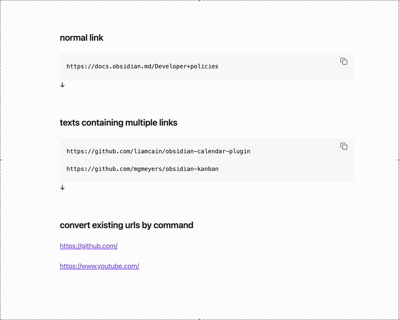

# Auto Link Converter

An Obsidian plugin that automatically converts pasted URLs into reference-style markdown links with page titles.

## Features

- **Automatic URL Conversion**: When you paste a URL, it automatically fetches the page title and converts it to a reference-style markdown link
- **Manual Conversion Command**: Convert selected URLs using the command palette
- **Customizable Settings**: Configure auto-conversion behavior and placeholder text

## Usage

### Automatic Conversion (Paste)

1. Copy text containing a URL (or URLs) to your clipboard
2. Paste it into your note (Ctrl/Cmd + V)
3. The plugin will automatically:
   - Fetch the page title
   - Convert the URL to a reference-style link

### Manual Conversion (Command)

1. Select one or more URLs in your note
2. Open the command palette (Ctrl/Cmd + P)
3. Run "Auto Link Converter: Convert selected links"
4. Selected URLs will be converted to reference-style links

## Settings

- **Enable auto-conversion**: Whether to automatically convert pasted URLs to reference-style links
- **Placeholder text**: The text to display when the title cannot be fetched from the URL (default: "Untitled")
